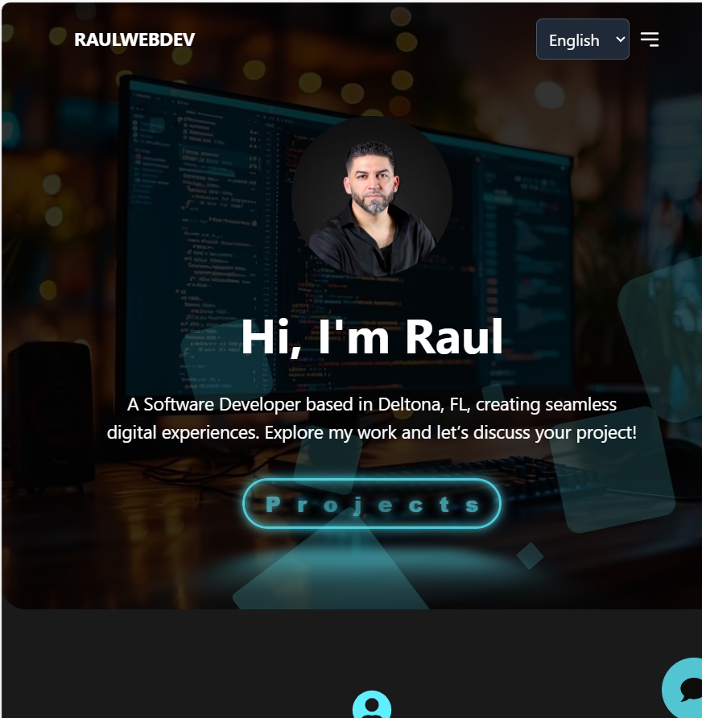
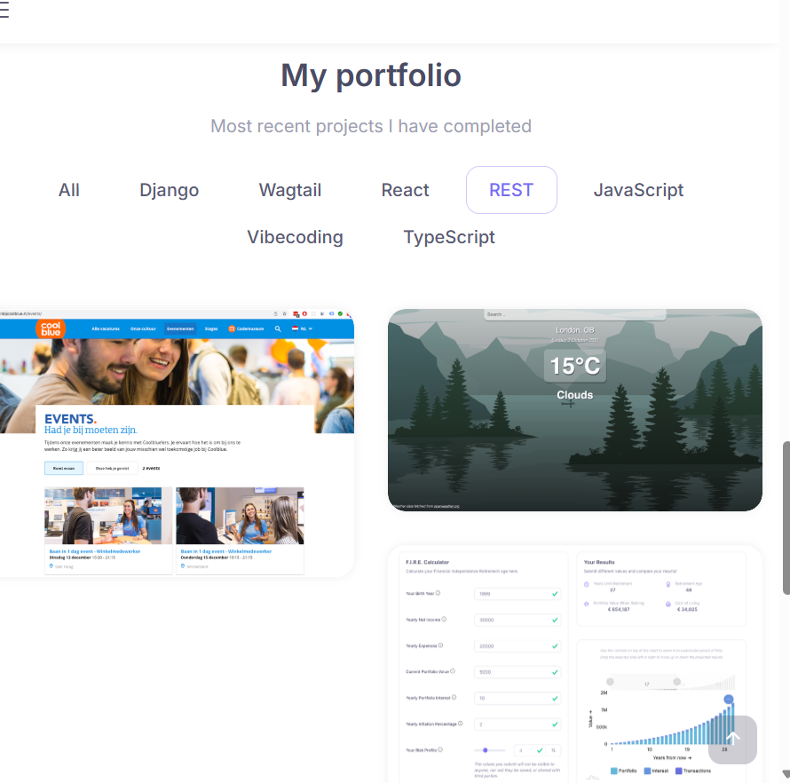
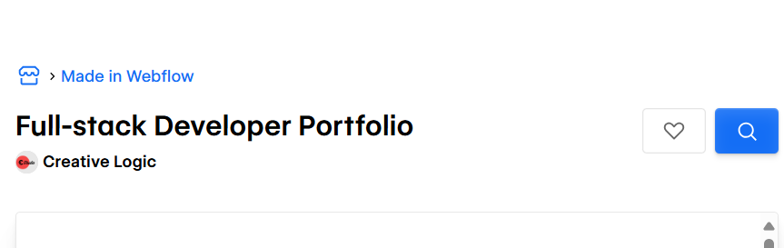

# Cahier des charges – Site CV / Portfolio

## 1. Présentation du projet

- **Nom du projet** : Portfolio CV [Karmous Orsula]  
- **Objectif** : Présenter mes compétences et projets 
- **Contexte** : projet de formation (WAD25) 

---

## 2. Inspirations / références

### Site 1
- **URL** : [Raul WebDev](https://raulwebdev.com/)  
- **Capture d’écran** :   
- **Pourquoi je l’aime** : la navigation entre les sections est simple et intuitive, le design est moderne et épuré, l'option des langues et les projets sont bien mis en valeur avec un accès facile et direct.

### Site 2
- **URL** : [Raoul Capello](https://www.raoulcapello.com/)  
- **Capture d’écran** :   
- **Pourquoi je l’aime** : j'aime la présentation des projets, le style également épuré de l’ensemble du site.

### Site 3
- **URL** : [Full-stack Developer Portfolio – Webflow](https://webflow.com/made-in-webflow/website/Full-stack-Developer-Portfolio?msockid=1c6268eed9186187202b7e8ad8e86019)  
- **Capture d’écran** :   
- **Pourquoi je l’aime** : l'option *J'aime*.

---

## 3. Ergonomie / Navigation

Le site sera conçu sous forme de **One Page**, avec une navigation fluide entre les différentes sections (Accueil, À propos, Compétences, Projets, CV, Contact).

### Type de navigation
- Menu fixe en haut de page (header), visible en permanence, avec des liens ancrés permettant de défiler directement jusqu’à chaque section.  
- Les projets seront présentés sous forme de cartes cliquables, avec possibilité d’ouvrir un détail ou un lien vers GitHub/démo.  
- Un footer sera présent en bas de page avec les liens vers LinkedIn, GitHub et email.

### Langues
- Le site sera **trilingue (FR/EN/NL)**, avec un bouton de changement de langue accessible dans le header.

### Confort utilisateur
- Responsive design : mise en page adaptée aux ordinateurs, tablettes et smartphones.  
- **Call To Action clair dès la page d’accueil** :  
  - bouton *“Voir mes projets”*  
  - bouton *“Télécharger mon CV”*  
- Navigation intuitive et minimaliste, sans éléments superflus.

---

## 4. Rubriques & Contenus

| Rubrique    | Contenu prévu                                                                 |
|-------------|-------------------------------------------------------------------------------|
| **Accueil** | - Photo ou avatar - Phrase d’accroche (*“Web App Developer – Symfony & JS”*) - 2 boutons CTA : *“Voir mes projets”* / *“Télécharger mon CV”* |
| **À propos**| - Brève présentation personnelle (bio) - Parcours et formation - Objectif professionnel / rôle recherché |
| **Compétences** | - Back-end : PHP, Symfony, MySQL - Front-end : HTML, CSS, JavaScript - Outils : Git/GitHub, Docker, PHPUnit - Soft skills (organisation, travail en équipe, autonomie) |
| **Projets** | - 2 à 3 projets sélectionnés - Pour chaque projet : titre, courte description, stack utilisée, rôle, capture d’écran, lien GitHub/démo |
| **CV**      | - Bouton de téléchargement du CV en PDF - Mention : *“Dernière mise à jour : [date]”* |
| **Contact** | - Email professionnel - Liens LinkedIn et GitHub - Formulaire de contact simple (Nom, Email, Message) en option |
| **Footer**  | - © Orsula Karmous - Liens rapides (Accueil, Projets, Contact) - Mentions légales (si nécessaires) |

---

## 5. Schéma One-Page
───────────────────────────────────────────────────────────────┐
│ LOGO            Orsula Accueil À propos Compétences Projets│
│ CV Contact    [FR|EN|NL] │
└───────────────────────────────────────────────────────────────┘
│ (menu fixe)
▼
┌───────────────────────────────────────────────────────────────┐
│ [SECTION #home] │
│ Titre/accroche: "Web App Developer (PHP/Symfony & JS)" │
│ Sous-texte court │
│ [Voir mes projets] [Télécharger mon CV] │
└───────────────────────────────────────────────────────────────┘
▼
┌───────────────────────────────────────────────────────────────┐
│ [SECTION #about] │
│ Photo | Bio courte | Valeurs | Ce que je recherche │
└───────────────────────────────────────────────────────────────┘
▼
┌───────────────────────────────────────────────────────────────┐
│ [SECTION #skills] │
│ Backend: PHP, Symfony, MySQL | Front: HTML/CSS/JS │
│ Outils: Git/GitHub, Docker, PHPUnit… │
│ (icônes/puces, 2–3 colonnes) │
└───────────────────────────────────────────────────────────────┘
▼
┌───────────────────────────────────────────────────────────────┐
│ [SECTION #projects] │
│ ┌─────────────┐ ┌─────────────┐ ┌─────────────┐ │
│ │ Carte P1 │ │ Carte P2 │ │ Carte P3 │ │
│ │ Titre │ │ Titre │ │ Titre │ │
│ │ Stack • Lien │ │ Stack • Lien │ │ Stack • Lien │ │
│ └─────────────┘ └─────────────┘ └─────────────┘ │
│ [Voir plus] (GitHub) │
└───────────────────────────────────────────────────────────────┘
▼
┌───────────────────────────────────────────────────────────────┐
│ [SECTION #cv] │
│ Bouton: [Télécharger mon CV (PDF)] │
└───────────────────────────────────────────────────────────────┘
▼
┌───────────────────────────────────────────────────────────────┐
│ [SECTION #contact] │
│ Email • LinkedIn • GitHub | (Formulaire simple optionnel) │
└───────────────────────────────────────────────────────────────┘
▼
┌───────────────────────────────────────────────────────────────┐
│ Footer: © Orsula Karmous — Liens rapides — Mentions │
└───────────────────────────────────────────────────────────────┘
